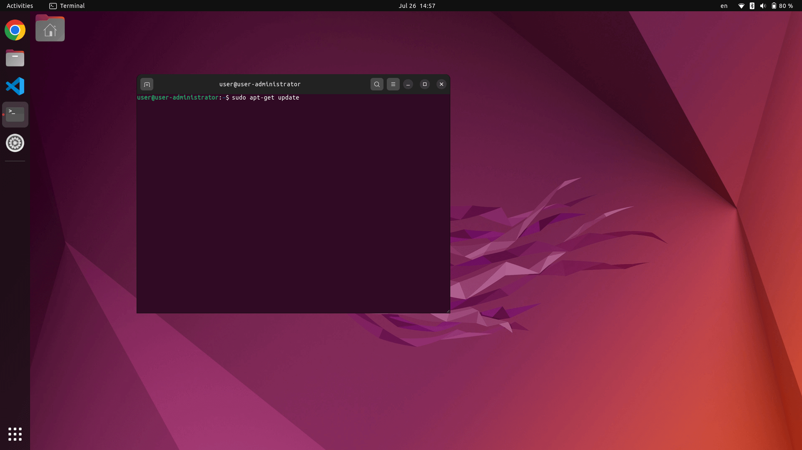

# Ubuntu 22.04 in Svelte

This open-source project aims to replicate the Ubuntu 22.04 desktop experience on the web, using Svelte!

> The project still in development, and many new feature will be added

Try it now: 🔗 https://ubuntu2204-svelte.vercel.app/

## What it has?

-   [x] Desktop, Dock (side bar) and Panel (top bar)
-   [x] System Menu, Calendar
-   [x] Google Chrome, VS Code, Settings (WIP), Terminal, Calculator
-   [x] A "working" terminal
-   [x] Resizable windows
-   [ ] (WIP) Text Editor, File Manager
-   [ ] (WIP) Boot screen, lock screen

📝 You can always [suggest more features](https://github.com/manhhungpc/ubuntu2204-svelte/issues)

## Tech stack

-   😻 Svelte - Loved by developers. It's fun!
-   ⚡ Vite - It's fast!
-   🌊 Tailwind & CSS - Make it look beautiful
-   ▶️ Flowbite Svelte - A flexible UI components library for Svelte

## FAQ

-   Can I use this as a OS/server?
    -   No, this is not a complete OS/server and not affiliated to Ubuntu/Linux in anyway
        

        
        

-   Do the commands I type in the terminal affect my computer?
    -   No, it does nothing. It just simulate the terminal-like experience, without sending or downloading anything to your computer
-   Can I contribute?
    -   Yes of course! All suggestions, bugs fixing are welcome. Just open an issue and create a pull request
-   Do you get any inspiration?
    -   [Win11-svelte](https://github.com/yashash-pugalia/win11-svelte/tree/main) by yashash-pugalia and [macos-web](https://github.com/PuruVJ/macos-web) by PuruVJ
